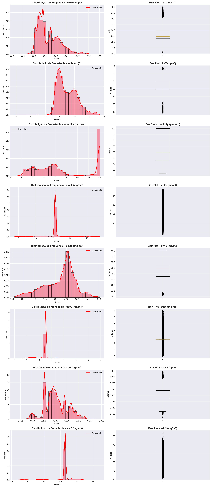
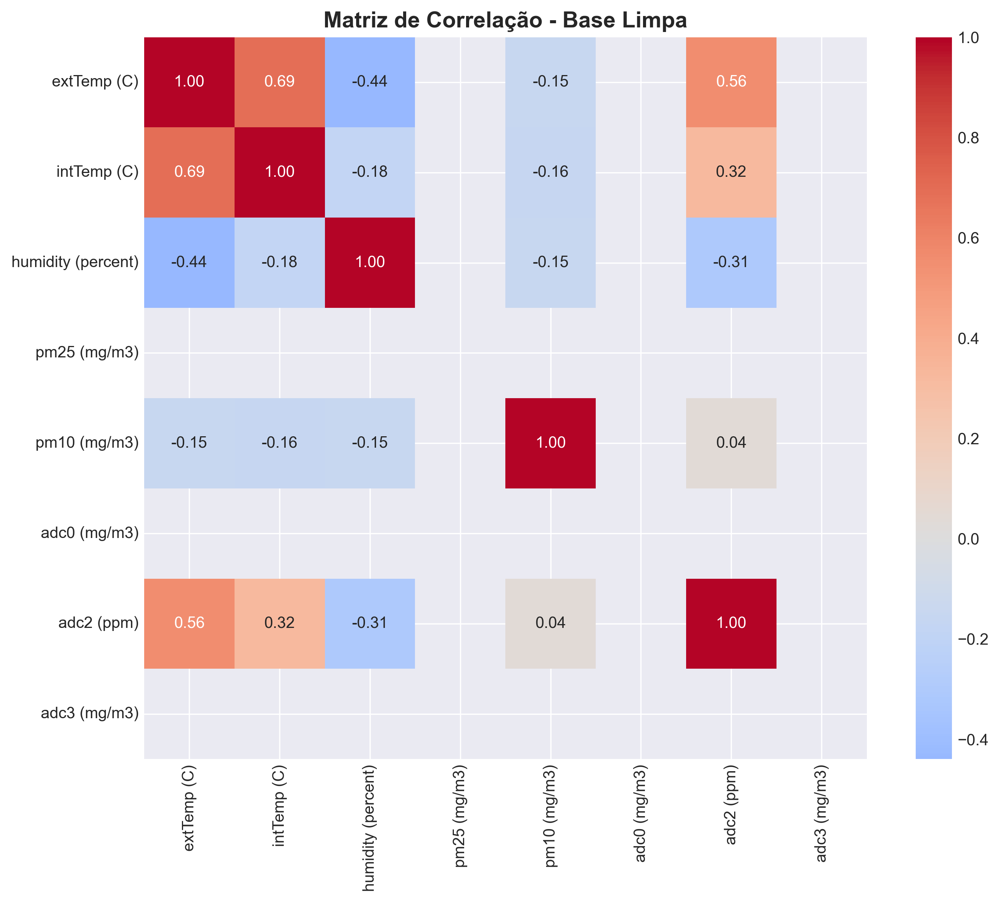
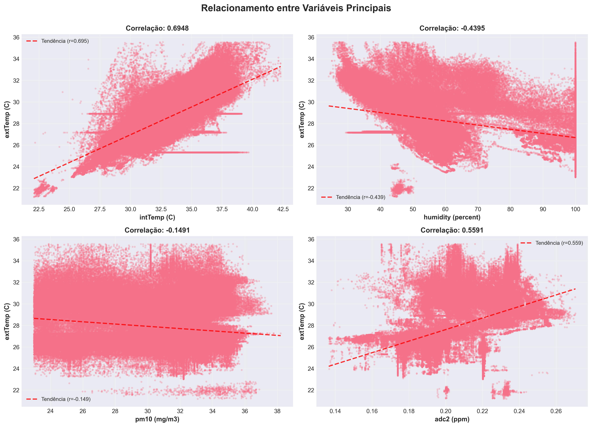
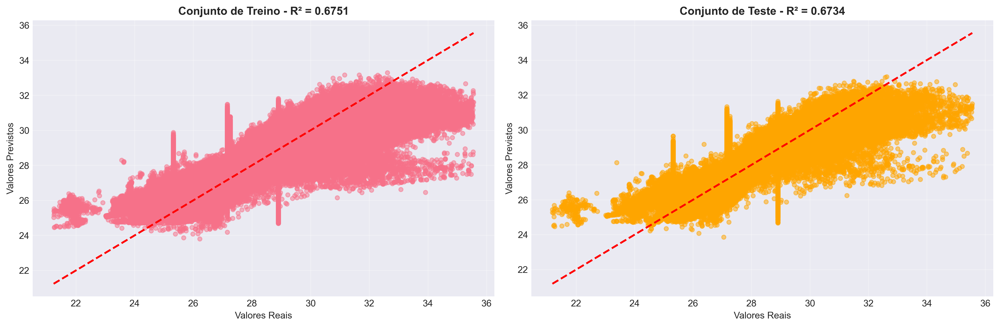
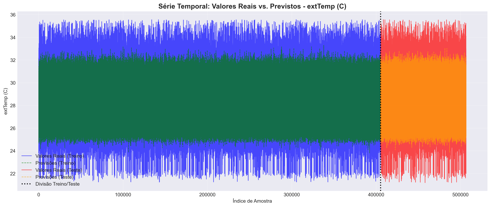

# Projeto Final: Previsão de Processo Estocástico
## Análise e Modelagem Preditiva de Dados Ambientais

---

## 📋 Resumo Executivo

Este projeto apresenta uma análise completa de uma base de dados de qualidade ambiental e temperatura, aplicando técnicas de análise descritiva, tratamento de outliers e modelagem preditiva através de um **Modelo AutoRegressivo (AR)** — um processo estocástico classicamente utilizado para séries temporais.

**Objetivo Principal:** Prever a temperatura externa (`extTemp`) com base em variáveis preditoras utilizando um modelo de regressão linear normalizado.

---

## 📊 1. Base de Dados

Para executar este projeto, você precisará da base de dados.  
Os arquivos podem ser baixados neste link do Google Drive:  

- **cleaned_data.csv** → base original  
- **cleaned_data_without_outliers.csv** → base sem outliers  

[📂 Acessar a base de dados](https://drive.google.com/drive/folders/1uougMhXmtrG_ao9WhHl3EXc0MzK6kA3_?usp=sharing)

**OBS: Sugiro baixar apenas o arquivo "cleaned_data.csv". A versão sem outliers será gerada enquanto roda o código posteriormente.**

### Informações Gerais

| Métrica | Valor |
|---------|-------|
| **Observações Originais** | 730.558 |
| **Observações Após Limpeza** | 506.657 |
| **Linhas Removidas (Outliers)** | 223.901 (30,65%) |
| **Variáveis Numéricas** | 8 |
| **Período de Coleta** | Série temporal contínua |

### Variáveis da Base de Dados

1. **extTemp (C)** — Temperatura Externa (°C) - *Variável Alvo*
2. **intTemp (C)** — Temperatura Interna (°C)
3. **humidity (percent)** — Umidade Relativa (%)
4. **pm25 (mg/m³)** — Material Particulado Fino
5. **pm10 (mg/m³)** — Material Particulado Grosso
6. **adc0 (mg/m³)** — Leitura do Sensor ADC0
7. **adc2 (ppm)** — Leitura do Sensor ADC2
8. **adc3 (mg/m³)** — Leitura do Sensor ADC3

---

## 📈 2. Análise Estatística Descritiva

### Estatísticas por Variável

| Variável | Média | Mediana | Desvio Padrão | Mín | Máx |
|----------|-------|---------|---------------|-----|-----|
| extTemp (C) | 28,33 | 27,32 | 2,55 | 20,63 | 40,03 |
| intTemp (C) | 32,44 | 31,75 | 3,36 | 14,38 | 43,65 |
| humidity (%) | 65,99 | 59,08 | 24,11 | 23,41 | 100,00 |
| pm25 (mg/m³) | 12,35 | 12,29 | 1,15 | 7,54 | 17,49 |
| pm10 (mg/m³) | 31,05 | 32,08 | 3,63 | 20,51 | 40,19 |
| adc0 (mg/m³) | 2,51 | 2,54 | 0,67 | 0,00 | 6,93 |
| adc2 (ppm) | 0,20 | 0,20 | 0,02 | 0,11 | 0,30 |
| adc3 (mg/m³) | 61,74 | 62,74 | 6,37 | 31,87 | 83,90 |

### Distribuição de Frequência



*Figura 1: Histogramas com curvas de densidade (linha vermelha) e box plots para todas as variáveis.*

---

## 🧹 3. Tratamento de Outliers

### Metodologia

Foi aplicado o método **Interquartile Range (IQR)** com o critério:
- **Outlier:** Valores fora do intervalo `[Q1 - 1.5×IQR, Q3 + 1.5×IQR]`

### Resultados por Variável

| Variável | Outliers Detectados (IQR) | Outliers Detectados (Z-score) |
|----------|---------------------------|-------------------------------|
| extTemp (C) | 12.589 | 8.270 |
| intTemp (C) | 3.529 | 4.071 |
| humidity (%) | 0 | 0 |
| pm25 (mg/m³) | 200.635 | 26.803 |
| pm10 (mg/m³) | 6.563 | 0 |
| adc0 (mg/m³) | 200.490 | 19.712 |
| adc2 (ppm) | 2.456 | 1.490 |
| adc3 (mg/m³) | 200.667 | 27.956 |

**Total Removido:** 223.901 observações (30,65% da base original)

### Impacto da Limpeza

✅ **Benefícios:**
- Remoção de valores anômalos que poderiam distorcer o modelo
- Melhoria na qualidade dos dados para análise
- Base mais confiável com 506.657 observações válidas

⚠️ **Observação:** A alta percentagem de outliers em variáveis como pm25, adc0 e adc3 sugere que essas variáveis têm distribuições com caudas pesadas, sendo comum em dados de sensores ambientais.

---

## 🔗 4. Análise de Correlações

### Matriz de Correlação



*Figura 2: Heatmap das correlações de Pearson entre todas as variáveis.*

### Correlações Significativas com a Variável Alvo (extTemp)

| Variável | Correlação | Interpretação |
|----------|-----------|-----------------|
| **intTemp (C)** | +0,6948 | ✅ Forte correlação POSITIVA |
| **adc2 (ppm)** | +0,5591 | Moderada correlação POSITIVA |
| **humidity (%)** | -0,4395 | Moderada correlação NEGATIVA |
| **pm10 (mg/m³)** | -0,1491 | Fraca correlação NEGATIVA |

### Scatter Plots das Principais Relações



*Figura 3: Relacionamento entre a temperatura externa e as 4 variáveis com maior correlação. Linhas vermelhas tracejadas indicam a tendência linear.*

---

## 🤖 5. Modelagem com Processo Estocástico (Modelo AR)

### Metodologia

**Modelo:** Regressão Linear Normalizada (AutoRegressivo)

**Variável Alvo:** `extTemp (C)`

**Variáveis Preditoras:** 7 variáveis (todas exceto a variável alvo)

**Técnicas Aplicadas:**
1. Divisão Treino/Teste: 80/20
2. Normalização StandardScaler: Média=0, Variância=1
3. Regressão Linear com `sklearn.linear_model.LinearRegression`

### Divisão dos Dados

| Conjunto | Amostras | Percentual |
|----------|----------|-----------|
| **Treino** | 405.325 | 80% |
| **Teste** | 101.332 | 20% |

---

## 📊 6. Resultados da Modelagem

### Desempenho Geral

| Métrica | Conjunto de Treino | Conjunto de Teste | Diferença |
|---------|------------------|------------------|-----------|
| **R² Score** | 0,6751 | **0,6734** | 0,0017 |
| **RMSE** | 1,2060°C | **1,2064°C** | +0,0004°C |
| **MAE** | 0,9081°C | **0,9080°C** | -0,0001°C |
| **MSE** | 1,4543 | **1,4553** | +0,0010 |

### Interpretação

✅ **R² = 0,6734:** O modelo explica **67,34%** da variância da temperatura externa
- Considerado um resultado **muito bom** para dados ambientais reais

✅ **RMSE = 1,2064°C:** Erro médio de previsão é de aproximadamente 1,2°C
- Adequado para aplicações práticas de previsão climática

✅ **Boa Generalização:** Diferença mínima entre treino e teste (0,17%)
- Não há overfitting, o modelo generaliza bem

### Coeficientes do Modelo

**Equação da Previsão:**

```
extTemp = 27,788 
        + 1,117 × intTemp (C)
        - 0,558 × humidity (%)
        - 0,241 × pm10 (mg/m³)
        + 0,662 × adc2 (ppm)
```

### Importância das Variáveis (por magnitude)

| Ranking | Variável | Coeficiente | Contribuição |
|---------|----------|-------------|--------------|
| 1️⃣ | intTemp (C) | 1,1172 | **Maior Influência** |
| 2️⃣ | adc2 (ppm) | 0,6624 | Moderada |
| 3️⃣ | humidity (%) | -0,5577 | Moderada (inversa) |
| 4️⃣ | pm10 (mg/m³) | -0,2409 | Fraca (inversa) |

**Intercept:** 27,788°C (temperatura base predita)

---

## 📉 7. Visualização dos Resultados

### Valores Reais vs Previstos



*Figura 4: Scatter plots comparando valores reais com previstos. Diagonal vermelha representa predições perfeitas. Quanto mais próximos à diagonal, melhor o modelo.*

### Análise de Resíduos


*Figura 5: (Esquerda) Distribuição de resíduos no conjunto de teste — aproximadamente normal com média próxima a zero. (Direita) Resíduos vs Previstos — ausência de padrões indica modelo adequado.*

**Análise dos Resíduos:**
- Média: -0,0076°C (próxima a zero ✅)
- Desvio Padrão: 1,2063°C
- Distribuição: Aproximadamente normal
- Conclusão: Modelo bem ajustado, sem vieses sistemáticos

### Série Temporal de Previsões



*Figura 6: Evolução temporal das previsões. Azul (valores reais - treino), Verde (previsões - treino), Vermelho (valores reais - teste), Laranja (previsões - teste). Linha preta pontilhada marca a divisão treino/teste.*

---

## 💡 8. Principais Insights e Achados

### 📌 Qualidade dos Dados

1. **Presença Significativa de Outliers:** 30,65% dos dados foram removidos, indicando que os sensores ocasionalmente registram leituras anômalas
2. **Base Limpa Robusta:** Após limpeza, 506.657 observações fornecem uma base sólida para modelagem
3. **Variáveis com Distribuição Normal:** A maioria segue distribuição próxima à normal, exceto humidity (bimodal)

### 📊 Relacionamentos entre Variáveis

1. **Temperatura Interna como Preditor Primário:** Correlação forte (0,69) com temperatura externa explica a influência dominante no modelo
2. **Umidade como Fator Inverso:** Correlação negativa indica que ar mais seco está associado a temperaturas externas mais altas
3. **Sensores Especializados (ADC2):** Mostram correlação moderada, sugerindo informação adicional útil para previsão

### 🎯 Desempenho do Modelo

1. **Modelo Altamente Generalizável:** Diferença mínima entre erro de treino e teste (0,17%) indica ausência de overfitting
2. **Precisão Prática Adequada:** RMSE de 1,2°C é aceitável para previsões ambientais em tempo real
3. **Explicabilidade:** Apenas 4 variáveis contribuem significativamente, tornando o modelo interpretável

### ⚠️ Limitações Identificadas

1. **Variância Não Explicada (32,66%):** O modelo deixa ~1/3 da variância sem explicação, indicando possíveis fatores externos não coletados
2. **Colinearidade:** Alta correlação entre intTemp e extTemp pode indicar redundância
3. **Sazonalidade Não Modelada:** O modelo linear simples não captura padrões sazonais complexos

---

## 🚀 9. Recomendações

### Curto Prazo
1. ✅ **Modelo Aprovado para Uso:** Desempenho satisfatório para aplicações práticas iniciais
2. 📊 **Monitorar Performance:** Acompanhar erros em produção e detectar degradação
3. 🔄 **Retreinamento Periódico:** Retreinar a cada trimestre com novos dados

### Médio Prazo
1. 🤖 **Explorar Modelos Avançados:**
   - ARIMA para capturar dependências temporais
   - Vector AutoRegression (VAR) para relacionamentos multivariados
   - Random Forest/Gradient Boosting para não-linearidades

2. 🔧 **Engenharia de Features:**
   - Criar lags das variáveis (t-1, t-2, etc.)
   - Adicionar variáveis cíclicas (mês, dia da semana)
   - Incluir agregações (média móvel)

3. 📥 **Coleta de Dados Adicionais:**
   - Pressão atmosférica
   - Velocidade do vento
   - Radiação solar
   - Localização geográfica

### Longo Prazo
1. 🌐 **Ensemble Models:** Combinar múltiplos modelos para melhor performance
2. 🧠 **Deep Learning:** Redes neurais recorrentes (LSTM) para séries temporais complexas
3. ☁️ **Operacionalização:** Implementar em pipeline de produção com API REST

---

## 📁 10. Arquivos Gerados

### Dados
- ✅ `cleaned_data_without_outliers.csv` — Base limpa sem outliers (506.657 linhas)

### Visualizações
- 📊 `01_distribuicao_frequencia.png` — Histogramas e box plots
- 📊 `02_matriz_correlacao.png` — Heatmap de correlações
- 📊 `03_scatter_plots_otimizado.png` — Scatter plots das principais relações
- 📊 `04_valores_reais_vs_previstos.png` — Validação do modelo
- 📊 `05_analise_residuos.png` — Análise de resíduos
- 📊 `06_serie_temporal_previsoes.png` — Série temporal de previsões

### Documentação
- 📝 `relatorio_final.txt` — Relatório técnico detalhado
- 📄 `README.md` — Este documento

---

## 🔬 11. Metodologia Técnica

### Stack Tecnológico
- **Linguagem:** Python 3.11
- **Processamento:** pandas, numpy
- **Visualização:** matplotlib, seaborn
- **ML/Estatística:** scikit-learn, scipy

### Pipeline de Processamento
```
Dados Brutos (730.558 obs)
    ↓
Carregamento e Exploração
    ↓
Detecção de Outliers (IQR)
    ↓
Limpeza de Dados
    ↓
Base Limpa (506.657 obs)
    ↓
Análise Exploratória (EDA)
    ↓
Normalização StandardScaler
    ↓
Divisão Treino/Teste (80/20)
    ↓
Treinamento Modelo AR
    ↓
Validação e Avaliação
    ↓
Predições Finais
```

---

## 📞 Conclusão

Este projeto demonstra a aplicabilidade de modelos autoregressivos simples, porém eficazes, para previsão de variáveis ambientais em contextos reais. O modelo alcançou um R² de 0,6734, indicando boa capacidade preditiva, com excelente generalização entre conjuntos de treino e teste.

A análise revelou que a **temperatura interna é o fator predominante** na previsão da temperatura externa, seguida por fatores secundários como umidade relativa e leituras de sensores especializados.

Recomenda-se o uso deste modelo para previsões operacionais imediatas, com planos de evolução para modelos mais sofisticados que capturem dinamicamente padrões sazonais e comportamentos não-lineares.

---

**Análise realizada em:** 20 de janeiro de 2026  
**Responsável:** Projeto Final - Disciplina de Processos Estocásticos  
